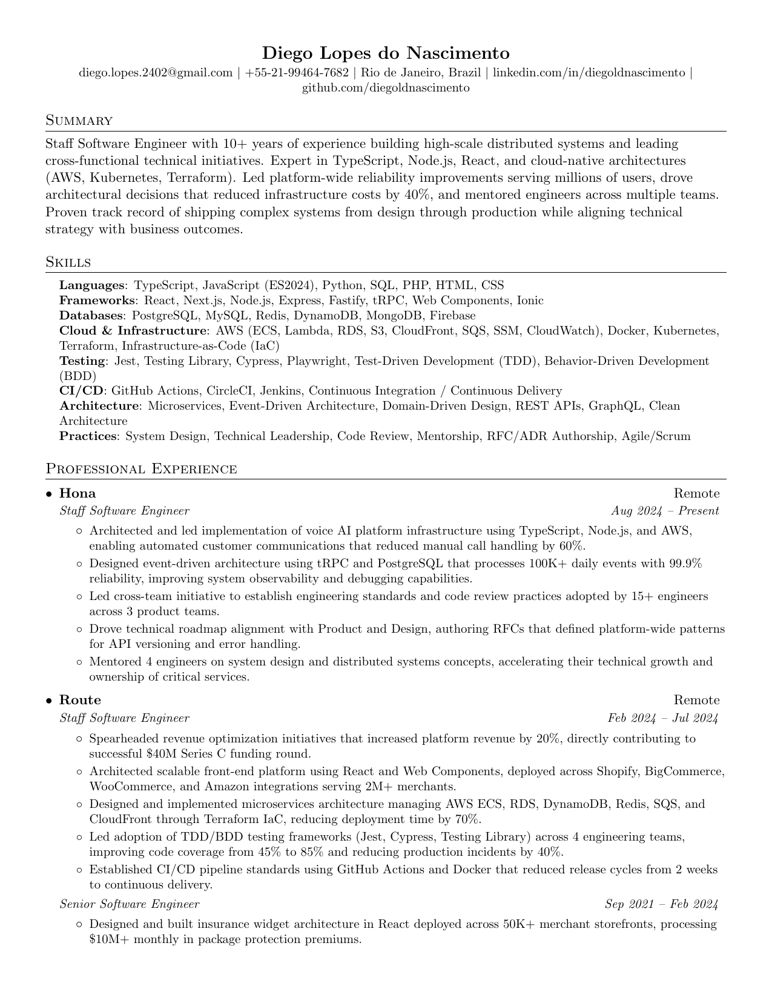
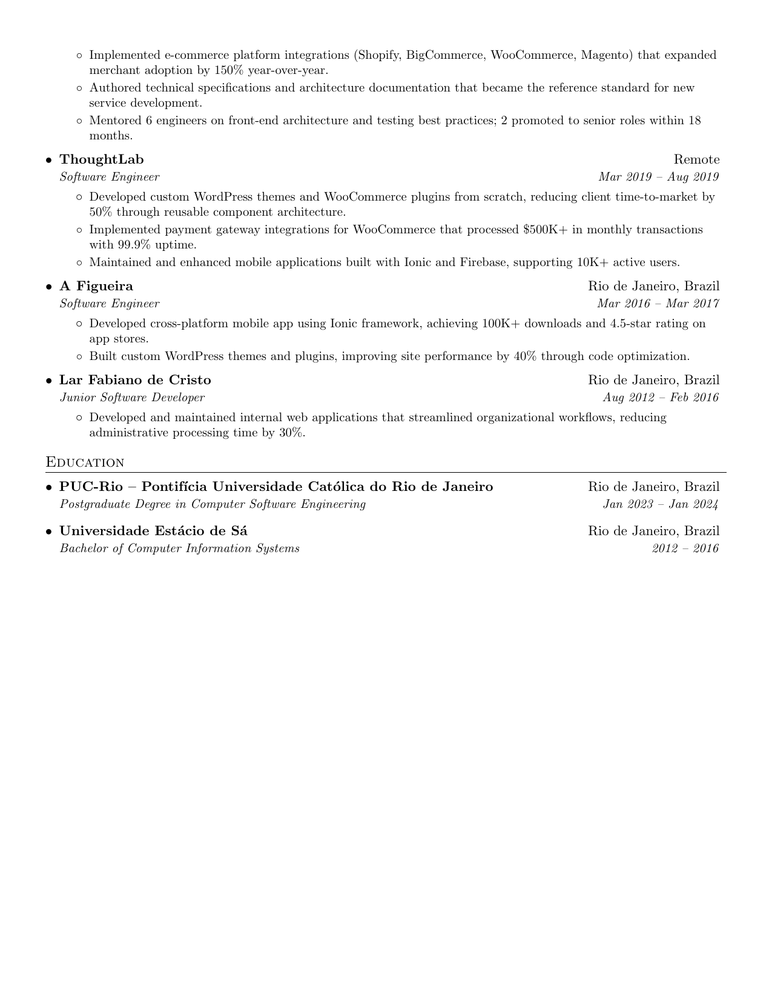

# Diego Lopes - Resume

A single-page, one-column resume optimized for ATS (Applicant Tracking Systems) and human readability. Built with LaTeX for consistent formatting and easy maintenance.

## Preview

| Page 1 | Page 2 |
|--------|--------|
|  |  |

## Build

### Using the build script

```sh
./build.sh
```

### Using Docker manually

```sh
docker build -t sb2nov/latex .
docker run --rm -i -v "$PWD":/data sb2nov/latex pdflatex diego_lopes_resume.tex
```

## Structure

- `diego_lopes_resume.tex` - LaTeX source file
- `diego_lopes_resume.pdf` - Generated PDF
- `docs/` - Preview images
- `build.sh` - Build script
- `Dockerfile` - Docker image with texlive-full

## License

Format is MIT. Based on [sb2nov/resume](https://github.com/sb2nov/resume) template.
